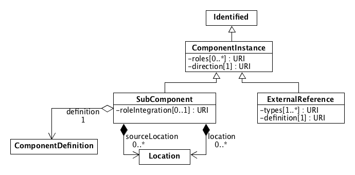

SEP 036 -- Externally grounded components
===================================

SEP                     | 036
----------------------|--------------
**Title**                | Externally grounded components
**Authors**           | Jacob Beal (<jakebeal@ieee.org>)
**Editor**            | Zach Palchick
**Type**               | Data Model
**SBOL Version** | 3.0
**Replaces**        | 
**Status**             | Accepted
**Issue** | [#81](https://github.com/SynBioDex/SEPs/issues/81)
**Created**          | 14-July-2019
**Last modified**  | 26-Jan-2020

## Abstract

This proposal adds an option for a `ComponentInstance` to use reference external definitions in databases like CHEBI or UniProt.

## Motivation 

When designs include small molecules, proteins, and reagents, right now they often cause a proliferation of "empty" `ComponentDefinition` objects that essentially only serve to be a link to an external definition in a database like CHEBI and UniProt. 

Doing this tends to obfuscate the sharing of reagents, by causing there to be many copies of the same reagent in different namespaces (or even the same namespace, due to accidental duplications).

Instead, we propose to provide an option for a `ComponentInstance` sibling class to `SubComponent` that goes directly to a non-SBOL grounding term rather than having to go through an "empty" `ComponentDefinition`.

## Specification 

In harmony with SEP 015, the new `ExternalReference` class is taken to be a sibling class of `SubComponent`, below the new unifying `ComponentInstance` class.

Note that this class diagram assumes SBOL 3 implementation of SEP 025, SEP 015, and SEP 010.

The `ExternalReference` class has the following three fields:
- The `definition` field is a link to a canonical definition external to SBOL.
- The `types` field is identical to its use in `ComponentDefinition`

The `roles` and `direction` fields are shared, and thus placed on `ComponentInstance`.

The `access` field is also dropped as generally unused and redundant with `direction`.

We may also add a weak validation rule that `definition` SHOULD refer to a non-SBOL canonical definition using an identifiers.org URI.

## Backwards Compatibility 

This is an SBOL 3 change because it depends on changes being made in the `SubComponent` and related class hierarchy.  

An `ExternalReference` can be down-converted to SBOL 2 by creating an "empty" `ComponentDefinition` and linking it with an appropriate type of SBOL 2 `Component`.

Upconversion of SBOL 2 is a "nice to have", since an "empty" `ComponentDefinition` is still valid under this proposal, just no longer necessary.  Implementing upconversion may be complicated, as one has to detect "empty" `ComponentDefinition` objects and figure out what convention was being used for linking to the external reference. This has typically been either a wasDerivedFrom link or a non-standard type, but may not be entirely automatable.

## Discussion 

The original proposal was to just modify `SubComponent` by allowing an optional type and making definition optional.  Since SEP 037 is creating a "pointer" class sibling to `ComponentInstance`, however, it seems sensible to do the same rather than unnecessarily complicating `SubComponent`, since there is no benefit here to accessing additional fields like `sourceLocations` and `roleIntegration`.

The names of SubComponent and ComponentInstance have been swapped.

## Competing SEPs 

No SEPs are directly competing.

This SEP assumes adoption of SEP 010, SEP 015, and SEP 025.

This SEP is compatible with SEP 037 and SEP 043

References 
----------------

Copyright 
-------------

  
   
  To the extent possible under law,
  <a rel="dct:publisher"
     href="sbolstandard.org">
    SBOL developers</a>
  has waived all copyright and related or neighboring rights to
  SEP 036.
This work is published from:

  United States.

