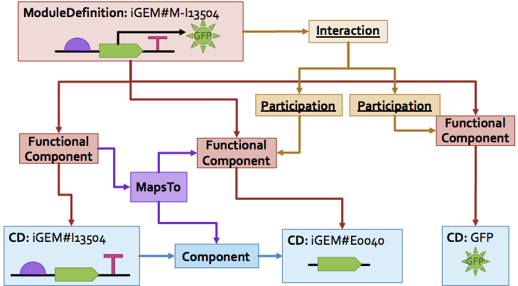
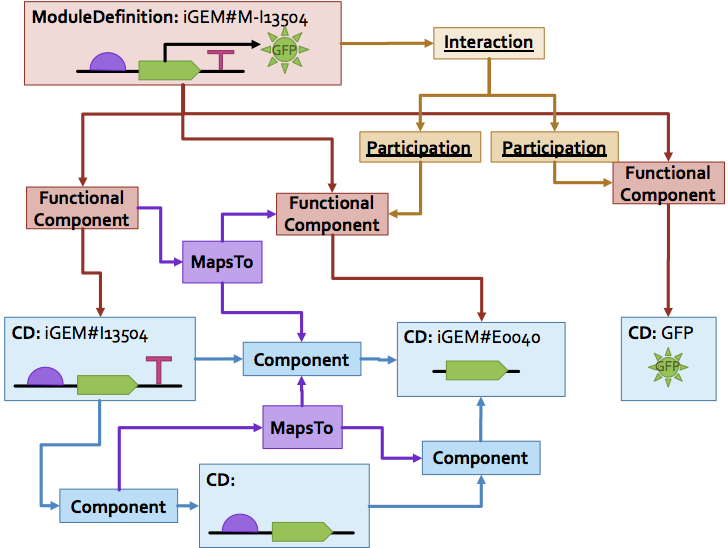
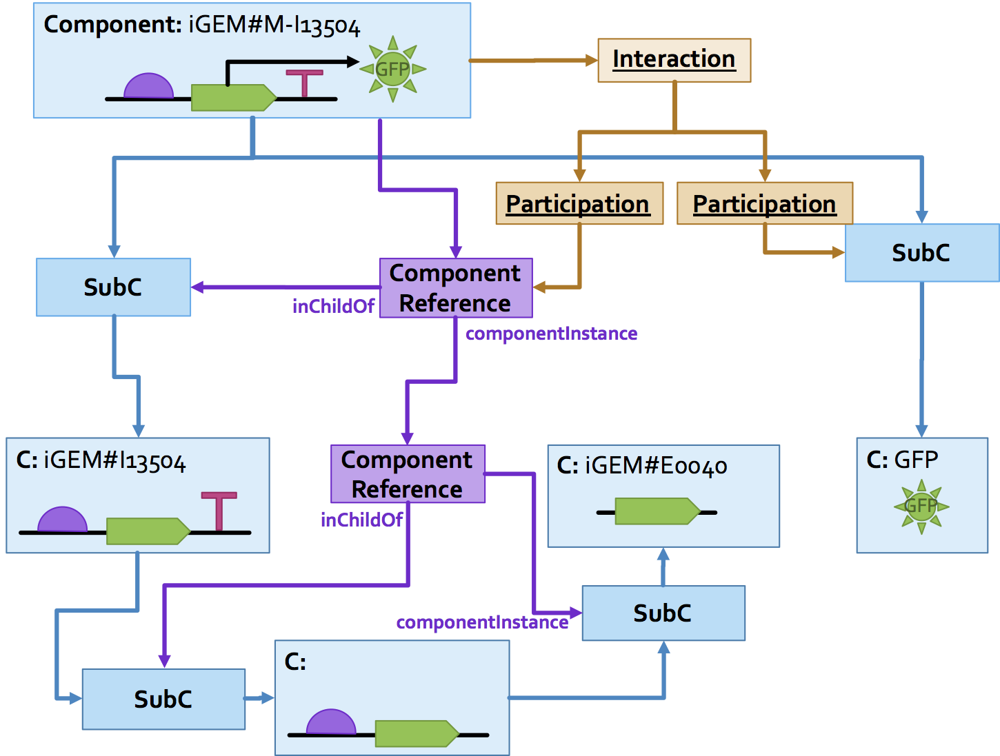

SEP 037 -- Component References
===================================

SEP                     | 037
----------------------|--------------
**Title**                | Component References
**Authors**           | Jacob Beal (<jakebeal@ieee.org>)
**Editor**            | James  McLaughlin
**Type**               | Data Model
**SBOL Version** | 3.0
**Replaces**        | 
**Status**             | Draft
**Created**          | 14-July-2019
**Last modified**  | 26-Jan-2020

## Abstract

This SEP proposes a ComponentReference class, sibling of Componentinstance, that allows a ComponentInstance to be referenced through children, rather than requiring it to be imported as an immediate child of the containing ComponentDefinition or ModuleDefinition.  A new DesignConstraint class (generalizing SequenceConstraint) then takes advantage of this to eliminate the need for MapsTo when linking equivalent components.

## Motivation 

In the current model, a ComponentDefinition or ModuleDefinition that wants to reference an ComponentInstance inside one of its children must import a copy from the child and link the two of them together with a MapsTo.  This is problematic in at least two ways:

1. This creates extra "duplicate" ComponentInstance objects that are confusing and offer extra opportunities for contradictory information to be added.
2. A MapsTo can only reach one level deep, so in order to refer more than one layer, the child definition must be modified as well.

This comes up in two cases: Interactions (in particular, the participant property of Participation), and linking equivalent objects via MapsTo (e.g., when instantiating an abstract component).

This figure shows example of one-layer being required in order to instantiate a genetic production relationship from a CDS in a constitutive expression construct, in which both a MapsTo and a FunctionalComponent must be created:

Here is an example of a two-layer reference, in which two MapsTo objects and two FunctionalComponents must be created, problematically requiring modification to the I13504 object:

Similar problems occur when linking equivalent objects via MapsTo, as shown in this figure:

## Specification 

### Class Structure

In harmony with SEP 015, the new `ComponentReference` class is taken to be a sibling class of `SubComponent`, below the new unifying `ComponentInstance` class.

Note that this class diagram assumes SBOL 3 implementation of SEP 025, SEP 015, SEP 010, and SEP 036.

### ComponentReference

A `ComponentReference` object provides access to `SubComponent` objects that are contained within the children of a `ComponentDefinition` or `ModuleDefinition`.  Its fields are:

- `inChildOf`[1] : URI for a `SubComponent`
- `componentInstance`[0..1] : URI for a `ComponentInstance`

The validation rules are:
- `inChildOf` must refer to a `SubComponent` pointed directly to by the parent of the `ComponentReference` (i.e., as a `subComponent` of `Component`, or an `inChildOf` of `ComponentReference`)
- If `componentInstance` is a `SubComponent`, then it must be a child of the `SubComponent` pointed to by `inChildOf`

Examples of using `ComponentReference`:

### Change SequenceConstraint to DesignConstraint

The `SequenceConstraint` class is generalized by renaming it to  `DesignConstraint`

Along with this change, two values are added to the domain of the `restriction` field:

* `sbol#verifyIdentical` (from Table 7, `MapsTo` refinements)
* `sbol#replaces` (unifying `useLocal` and `useRemote`)

Example of using `DesignConstraint`:

### Adjusted fields for Component and Participation

Everywhere that we can currently refer to a `SubComponent` (or SBOL2 subclass thereof), we adjust to refer to a `ComponentInstance`, thus allowing it to contain either instances or references.

### Removal of MapsTo

The `MapsTo` class is made obsolete by `ComponentReference` and `DesignConstraint`. as nearly every `MapsTo` relationship can be transformed into an equivalent set of `ComponentReference` and `DesignConstraint` relationships.

The only exceptions are `MapsTo` objects that use the `merge` value, since the constraint there is ill-defined.  Since these are rarely used and ill-defined, however, their loss is not anticipated to be a problem.

As such, `MapsTo` will be removed SBOL 3.

## Backwards Compatibility 

From SBOL 2 to SBOL3:

Any SBOL 2 usage of `MapsTo` with a value other than `merge` can be converted to a `DesignConstraint`. As an optimization, non-useful `SubComponent` objects may be replaced with `ComponentReference` objects

From SBOL 3 to SBOL 2, single-layer references may be converted to a duplicate object plus MapsTo. Not all references can be converted, hoewver.

## Discussion 

Discussion considered the potential to have ComponentReference be a completely separate class from SubComponent rather than a sibling class. This was considered to introduce additional complexity that was not particularly valuable, whereas both were types of ComponentInstances.

As part of discussion, it was also noted that:

- the access field on ComponentInstance should probably be dropped
- After Component/Module merging, some of the fields would probably want to be applied to ComponentReference as well.

The names of SubComponent and ComponentInstance have been swapped.

These three changes have been moved to SEP 036.

DesignConstraint was originally a separate class, and before that a much more restricted n-way ComponentEquivalence, which also preserved the merge type but not the asymmetric replacement relationships. This was simplified after discussion.

## Competing SEPs 

No SEPs are directly competing.

This SEP assumes adoption of SEP 010, SEP 015, SEP 025, and SEP 036.

This SEP is compatible with SEP 043.

References 
----------------

Copyright 
-------------

  
   
  To the extent possible under law,
  <a rel="dct:publisher"
     href="sbolstandard.org">
    SBOL developers</a>
  has waived all copyright and related or neighboring rights to
  SEP 037.
This work is published from:

  United States.

