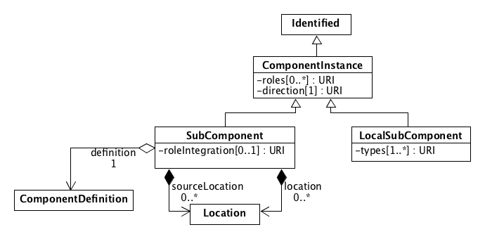

# SEP 043 -- Local SubComponents

SEP                     | <leave empty>
----------------------|--------------
**Title**                | Local SubComponents
**Authors**           | Jacob Beal (jakebeal@ieee.org)
**Editor**            | <leave empty>
**Type**               | Data Model
**SBOL Version** | 3.0 or 3.1
**Replaces**        |
**Status**             | Draft
**Created**          | 24-Jan-2020
**Last modified**  | 26-Jan-2020
**Issue** | [#91](https://github.com/SynBioDex/SEPs/issues/91)

## Abstract

In some cases, SubComponents are used for local placeholders or composites that only really make sense within the context of their parent Component, being defined in terms of their relationships  with other ComponentInstances.  In this case, it may be advantageous to be able to represent the local composite without giving it a complete definition. This SEP presents a method for doing so via a new LocalSubComponent subclass of ComponentInstance.

## 1. Rationale 

Currently, we often need to create "empty" ComponentDefinitions in order to serve as placeholders in more complex ComponentDefinitions.  

For example, if you create to define a template Component that captures a design pattern or a library design, each SubComponent that serves as a variable must be associated with a Component as its definition, even if that Component carries no information besides its type.

The same thing happens with composites that happen only within a larger system, such as stitching a promoter and CDS together into a functional unit.  The functional unit may exist only within its parent Component, but is still required to have a Component as its definition.

The thing that unifies these circumstances is that we know that the ComponentInstance really has no meaningful existence outside of its use as a child with its parent Component.  For such circumstances, rather than creating a SubComponent that points to an "empty" definition Component, we could instead make the intention explicit by creating a LocalSubComponent that is guaranteed to be nothing but a placeholder.

## 2. Specification 

In harmony with SEP 036 and SEP 037, the new `LocalSubComponent` class is taken to be a sibling class of `SubComponent`, below the new unifying `ComponentInstance` class.

Note that this class diagram assumes SBOL 3 implementation of SEP 025, SEP 015, SEP 010, and SEP 036.

The `LocalSubComponent` class has only one field, `types`, which is identical to its use in `Component`

## 3. Examples 

### Placeholders in a Template

Consider a component used for describing a library of cassettes with variable ribosome entry sites.  Its members are:

* SubComponent: promoter, with definition of BioBrick J23101, an Anderson library promoter.
* LocalSubComponent: RES, with type: DNA and role: SO:0000139 - Ribosome Entry Site
* SubComponent: CDS, with definition of BioBrick E0040 - GFPmut3 
* SubComponent: terminator, with definition of BioBrick B0015 - double terminator
* SequenceConstraints: promoter -> RES --> CDS --> terminator

The LocalSubComponent can then be instantiated as the Variant in a combinatorial design or via other one-off usages of this template.

### Composite Receiver

This system is comprised by combining two Components, and assumes adoption of SEP 037 (ComponentReferences) and SEP 041 (explicit locations).

The first is an AHL sender/receiver system, with no information about comparments:

* SubComponent: J23101-LuxI
* SubComponent: LuxI (enzyme)
* SubComponent: AHL (small molecule)
* SubComponent: LuxR (protein)
* SubComponent: Receiver, comprising tetR-RES-LuxR-terminator-pLux
* Interaction: J23101-LuxI produces LuxI enzyme
* Interaction: LuxI enzyme stimulates AHL
* Interaction: AHL + LuxR stimulates pLux

The second is a GFP reporter:

* SubComponent: GFP CDS
* SubComponent: GFP protein
* Interaction: GFP CDS produces GFP protein

These are combined into a system with the sender in one cell line, while  pLux is joined to GFP and the resulting composite receiver put in the second cell line:

* SubComponent: AHL sender/receiver
* SubComponent: GFP reporter
* SubComponent: Cell-Type-1
* SubComponent: Cell-Type-2
* Interaction: Cell-Type-1 contains (reference: J23101-LuxI in AHL sender/receiver)
* Interaction: Cell-Type-1 contains (reference: LuxI in AHL sender/receiver)
* Interaction: Cell-Type-2 contains (reference: LuxR in AHL sender/receiver)
* SequenceConstraint: (reference: tetR-RES-LuxR-terminator-pLux in AHL sender/receiver) precedes (reference: GFP CDS in GFP reporter)
* LocalSubComponent: Cell-2-DNA
* Interaction: Cell-Type-2 contains Cell-2-DNA
* Interaction: Cell-2-DNA contains (reference: GFP CDS in GFP reporter)
* Interaction: Cell-2-DNA contains (reference: tetR-RES-LuxR-terminator-pLux in AHL sender/receiver)

In this way, the LocalSubComponent is used to represent the fused piece of DNA that is placed within the second line of cells. If the Sequence is computed, this is where it would be attached with a Location as well (per SEP 041).

## 4. Backwards Compatibility 

There is a bidirectional mapping from SBOL 2 to SBOL 3:

From SBOL 2 to SBOL 3: LocalSubComponent is not necessary, so no conversion is technically needed. As an post-convertion optimization, however, any SubComponent whose definition has no content other than its types and rules may be converted into a LocalSubComponent.

From SBOL 3 to SBOL 2, any LocalSubComponent can be converted into a Component or FunctionalComponent (depending on context) whose definition is a new ComponentDefinition carrying its types and roles.

## 5. Discussion 

A potential alternative implementation is to make the `definition` field of SubComponent optional.  This would avoid adding a new class, but prevent distinguishing between a SubComponent with a missing definition (an error) and a SubComponent that is intentionally not provided with a definition.

A potential strengthening to consider would be to restrict the `variable` field of `VariableComponent` to point only to `LocalSubComponent` objects, and not just any `SubComponent`.  This might be overly restrictive, however.

## 6. Relation to Other SEPs 

This SEP assumes adoption of SEP 010, SEP 015, SEP 025, and SEP 036.

This SEP is compatible with SEP 037.

## Copyright 

  
   
  To the extent possible under law,
  <a rel="dct:publisher"
     href="sbolstandard.org">
    SBOL developers</a>
  has waived all copyright and related or neighboring rights to
  SEP 043.
This work is published from:

  United States.

