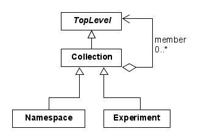
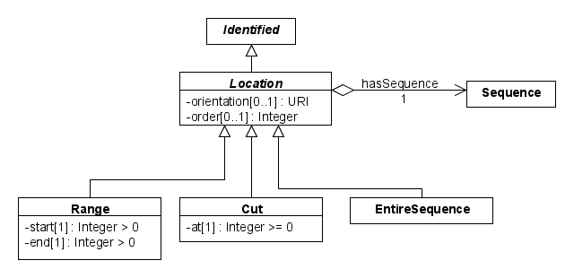

SEP 046 -- Changes in the new SBOL 3.0 specification
===================================

SEP                     | <leave empty>
----------------------|--------------
**Title**                | Changes in the new SBOL 3.0 specification
**Authors**           | Chris Myers (myers@ece.utah.edu), Jake Beal (jakebeal@gmail.com), James McLaughlin (james@mclgh.net), Bryan Bartley (bartleyba@sbolstandard.org), James Scott-Brown (james@jamesscottbrown.com), Pedro Fontanarrosa (pfontanarrosa@gmail.com), Prashant Vaidyanathan (t-prva@microsoft.com), Neil Wipat (neilwipat@gmail.com), Matthew Crowther (m.crowther1@ncl.ac.uk), Goksel Misirli (g.misirli@keele.ac.uk)
**Editor**            | Prashant Vaidyanathan (t-prva@microsoft.com), Pedro Fontanarrosa (pfontanarrosa@gmail.com), James McLaughlin (james@mclgh.net)
**Type**               | New Specification
**SBOL Version** | SBOL 3.0
**Replaces**        | SBOL 2.x
**Status**             | Final
**Created**          | 12-March-2020
**Last modified**  | 
**Issue**          | [#98](https://github.com/SynBioDex/SEPs/issues/98)

Abstract
-----------
In this document, a brief and high level overview of the changes
in the new SBOL 3 specification document is explained.

Table of Contents
---------------------

* [1. Rationale](#rationale)
* [2. Specification](#specification)
  * [2.1 List of SEPs implemented](#seplist)
  * [2.2 optional sub-point](#summary)
  * [2.3 Summary of the changes not included in previous SEPs](#newChanges)
* [3. Example or Use Case](#example)
* [4. Backwards Compatibility](#compatibility)
* [5. Discussion](#discussion)
* [6. Competing SEPs](#competing_seps)
* [References](#references)
* [Copyright](#copyright)

## 1. Rationale 
----------------

Sufficient SEPs accumulated proposing major data model changes that merited
a change in the specification from version 2.x to 3.0. This SEP summarizes the changes that have been implemented from various SEPs that have been accepted by the community along with changes that have been proposed after discussion at HARMONY 2020. 

## 2. Specification 
----------------------------------------------

### 2.1 List of SEPs implemented: 
* [SEP 10](https://github.com/SynBioDex/SEPs/blob/master/sep_010.md)
* [SEP 15](https://github.com/SynBioDex/SEPs/blob/master/sep_015.md)
* [SEP 25](https://github.com/SynBioDex/SEPs/blob/master/sep_025.md)
* [SEP 32](https://github.com/SynBioDex/SEPs/blob/master/sep_032.md)
* [SEP 36](https://github.com/SynBioDex/SEPs/blob/master/sep_036.md)
* [SEP 37](https://github.com/SynBioDex/SEPs/blob/master/sep_037.md)
* [SEP 38](https://github.com/SynBioDex/SEPs/blob/master/sep_038.md)
* [SEP 39](https://github.com/SynBioDex/SEPs/blob/master/sep_039.md)
* [SEP 40](https://github.com/SynBioDex/SEPs/blob/master/sep_040.md)
* [SEP 41](https://github.com/SynBioDex/SEPs/blob/master/sep_041.md)
* [SEP 42](https://github.com/SynBioDex/SEPs/blob/master/sep_042.md)
* [SEP 43](https://github.com/SynBioDex/SEPs/blob/master/sep_043.md)
* [SEP 44](https://github.com/SynBioDex/SEPs/blob/master/sep_044.md)
* [SEP 45](https://github.com/SynBioDex/SEPs/blob/master/sep_045.md)

### 2.2 Summary of the changes to the specification 
* `definition` renamed as `instanceOf`
* `dcterms:title` renamed as `sbol:name`
* `dcterms:description` renamed as `sbol:description`
* `persistentIdentity` removed from `Identified`
* `version` removed from `Identified`
* `Interface` has been introduced as a sub-class of `Identified`
* `NameSpace` has been introduced as a sub-class of `Collection`
* Added a new Abstract class `Feature`
  * Add `role` field to `Feature`
  * Add `direction` field to `Feature`
  * Add `orientation` field to `Feature`
* SBOL 2.x `Component` renamed as `SubComponent`
  * Add `location` field to `SubComponent`
  * Remove `access` field from `SubComponent`
  * Remove `direction` field from `SubComponent`. This is now inherited from the parent class `Feature`
* `SubComponent` is now a sub-class of `Feature`
* SBOL 2.x `SequenceAnnotation` renamed as `SequenceFeature`
  * Remove `component` field from `SequenceFeature`
  * Remove `roleIntegration` field from `SequenceFeature` 
* `SequenceFeature` is now a sub-class of `Feature`
* `ComponentReference` introduced as a sub-class of `Feature`
* `LocalSubComponent` introduced as a sub-class of `Feature`
* `ExternallyDefined` introduced as a sub-class of `Feature`
* SBOL 2.x `SequenceConstraint` has been renamed as `Constraint`
  * `Constraint.object` and `Constraint.subject` now point to `Feature`
  * The table of recommended restrictions for `Constraint` has been updated.
* Add `order` field to `Location`
* SBOL 2.x `GenericLocation` has been removed
* `EntireSequence` has been introduced as a sub-class of `Location`
* SBOL 2.x `ComponentDefinition` renamed as `Component`
  * Add `interface` field to `Component`
* SBOL 2.x `ModuleDefinition` properties moved to `Component`
  * SBO's FunctionalEntity term has been introduced as type for `Component`
  * SBOL 2.x `ModuleDefinition` has been removed
  * SBOL 2.x `Module` has been removed
* SBOL 2.x `FunctionalComponent` has been removed and any references to it have been changed to references to `SubComponent`
* SBOL 2.x `MapTos` has been removed.
* BioPAX `type` values have been changed to their SBO equivalents.
* SBOL has been made more Semantic Web friendly. This includes: 
  * Differentiating SBOL entities (concepts) and properties. A few examples include:
    * The `feature` field of `Component` which points to a `Feature` object, has now been renamed as `hasFeature`
    * The `variableComponent` field of `CombinatorialDerivation` which points to a `VariableComponent` object, has now been renamed as `hasVariableComponent`
  * Consistent labelling of SBOL entities
    * For instance, Access values will be capitalised. E.g. 'public' has been changed to 'Public', 'private' has been changed to 'Private', etc.  
  * `rdf:type` is now recommender over `sbol:type` to specify the type of an SBOL entity.
  * Enabling graph-based serialization of SBOL documents.   
* Properties/fields that were in plural form are now specified in singular form

-------------------------------
### 2.3 Summary of the changes not included in previous SEPs 
The following changes were proposed during HARMONY 2020 and have not been covered by any previous SEPs:

* The `operator` field of `VariableComponent` has been changed to `cardinality`
* `order` field has been added to `Location`
* `ComponentInstance` class has been renamed as `Feature`
  * The `ComponentInstance` class was introduced as an abstract class in [SEP 36](https://github.com/SynBioDex/SEPs/blob/master/sep_036.md), [SEP 37](https://github.com/SynBioDex/SEPs/blob/master/sep_037.md), and [SEP 43](https://github.com/SynBioDex/SEPs/blob/master/sep_043.md). This `ComponentInstance` class has now been renamed as `Feature`. 
* `SequenceFeature` class is now a sub-class of `Feature`
* The `hasSubComponent` and `hasFeature` fields of the `Component` class have been merged as a single field: `hasFeature` which points to a `Feature` object
  * This was a consequence of making `SequenceFeature` and `SubComponent` sub-classes of `Feature`.
* `hasSequence` field has been added back to `Component`
  * [SEP 41](https://github.com/SynBioDex/SEPs/blob/master/sep_041.md) removed `hasSequence` from `Component`, however `hasSequence` has been added back to `Component`.
* `orientation` field has been added to `Feature`
* `Experiment` is now a sub-class of `Collection`
* `NameSpace` is now a sub-class of `Collection` 
* `GenericLocation` has been removed. 
* Location's `EntireLocation` sub-class has been renamed as `EntireSequence`  
  * [SEP 41](https://github.com/SynBioDex/SEPs/blob/master/sep_041.md) introduced `EntireLocation`. This new class has been renamed `EntireSequence`. 
* `SequenceConstraint` has been renamed as `Constraint`
* `ExternalReference` has been renamed as `ExternallyDefined`
  * [SEP 36](https://github.com/SynBioDex/SEPs/blob/master/sep_036.md) introduced `ExternalReference` as a subclass of `Feature`. This new class has been renamed as `ExternallyDefined`.
* The `VariableComponent` class has 3 optional properties. There is a validation rule that states that at least one of them must not be empty. This validation rule has been deleted.
* Added the `hashAlgorithm` property to the `Attachment` class. 
The hash property is OPTIONAL and MAY contain the name of the hash algorithm used to generate the value of the hash property.
The value of this property SHOULD be a hash name string from the [IANA Named Information Hash Algorithm Registry](https://www.iana.org/assignments/named-information/named-information.xhtml), of which sha3-256 is currently recommended.
If the hash property is set, then `hashAlgorithm` MUST be set as well.

## 3. Example or Use Case 
-------------------------------
In this section, we show the UML diagrams of the classes that have undergone changes that were not part of any previous SEPs. 

* Collection UML

* Component UML

* Feature UML

* Location UML

* VariableComponent UML

## 4. Backwards Compatibility 
-----------------

## 5. Discussion 
-----------------

## 6. Competing SEPs 
-----------------
None.

References 
----------------
None.

Copyright 
-------------

  
   
  To the extent possible under law,
  <a rel="dct:publisher"
     href="sbolstandard.org">
    SBOL developers</a>
  has waived all copyright and related or neighboring rights to
  SEP 002.
This work is published from:

  United States.

